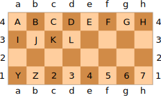

# C

> An esoteric programming language that looks like Chess notation

## Specification

- Program memory is laid out in an 8x8 grid (called the _board_), like a chessboard.
- Each square holds a single 5-bit value (called a _piece_) canonically represented as a single [RFC 4648 base-32](https://datatracker.ietf.org/doc/html/rfc4648#section-6) digit (printable character)
- Programs are made up of instructions separated by whitespace.
- Each instruction is a few ASCII characters that describes an operation to perform, data to be written to a square, or another kind of action.

### Values

Many programming languages work with bytes (8-bit values) as their native unit of data. C works with 5-bit values, and each 5-bit value is called a _piece_. When written down, a piece is canonically represented as a single [RFC 4648 base-32](https://datatracker.ietf.org/doc/html/rfc4648#section-6) character. This notation starts at `A` for 0, going up to `Z` to represent 25, and then uses the digits `2` to `7` to represent values 26 to 31.

The following table, copied [from Wikipedia](https://en.wikipedia.org/wiki/Base32#Base_32_Encoding_per_%C2%A76), shows the mapping of denary (base-10) values to their RFC 4648 base-32 representations.

| Value | Symbol | Value | Symbol | Value | Symbol | Value | Symbol |
| ----- | ------ | ----- | ------ | ----- | ------ | ----- | ------ |
| 0     | **A**  | 8     | **I**  | 16    | **Q**  | 24    | **Y**  |
| 1     | **B**  | 9     | **J**  | 17    | **R**  | 25    | **Z**  |
| 2     | **C**  | 10    | **K**  | 18    | **S**  | 26    | **2**  |
| 3     | **D**  | 11    | **L**  | 19    | **T**  | 27    | **3**  |
| 4     | **E**  | 12    | **M**  | 20    | **U**  | 28    | **4**  |
| 5     | **F**  | 13    | **N**  | 21    | **V**  | 29    | **5**  |
| 6     | **G**  | 14    | **O**  | 22    | **W**  | 30    | **6**  |
| 7     | **H**  | 15    | **P**  | 23    | **X**  | 31    | **7**  |

Throughout this document, values will often be written in RFC 4648 base-32. This will be indicated by a subscript 32, e.g. F<sub>32</sub> to represent the value 5.

In case you're wondering how pieces relate to other units of data such as bytes, here's a "helpful" bulleted list:

- 1 bit = **1** bit
- 1 nibble = **4** bits
- 1 piece = **5** bits
- 1 byte = **8** bits
- In Windows terminology, 1 WORD = **16** bits

#### Data types

Fortunately, you only need to learn about one data type to code in C.

##### Integers

C considers integers to be the best data type, and idiomatic C programs will reflect this ideal in their documentation. Naturally, C stores integers on the board as unsigned pieces, giving each integer a range of 0 to 31.

#### Empty square

When a C program is executed, all squares start as empty. This state is not truly a data type, but rather the lack of any data. It's different to a value of zero. You can think of it as `None` in Python, or perhaps `undefined` in JavaScript.

Once a square has had a piece placed on it, it can't become empty again (unless the piece is thrown off due to an exception being thrown).

Most operations will fail with a `NullPointerException` if you attempt to perform it on an empty square.

##### Booleans

Boolean values are represented in C as integers. 0 is equivalent to `false`, and `1` is equivalent to `true`.

For the purposes of [boolean operations](#boolean-operations), the value 0 is considered falsy and any other value is considered truthy.

##### Floating-point numbers

C does not support floating-point numbers. Instead, you should use the superior integer data type.

##### Characters and strings

Characters and strings are not supported yet.

Strings carry a variety of complications, including localization, normalization, and delocalisation. It is suggested to use integers for input and output instead.

Characters may be defined as a data type in a future version of C. They will likely be stored as two pieces per character, using the UTF-10 Unicode encoding that will be specific to C.

### Referencing board squares

Board squares (equivalent to memory locations) are referenced using coordinates in the same way as algebraic chess notation. Two characters are used:

1. A lowercase letter (`a`-`z`) to specify the file (column).
2. A non-zero digit (`1`-`9`) to specify the rank (row).

By default, the board has 8 files and 8 ranks, so the valid squares are from `a1` to `h8`. Implementations may support extended board sizes as an opt-in feature.

Example: `g5` would represent the square highlighted in the diagram below.

[](https://en.wikipedia.org/wiki/File:SCD_algebraic_notation.svg)

### Writing data to the board

#### Placing pieces

The simplest kind of write instruction is to place a single piece of data on a single empty square. It consists of 3 characters:

1. The first character is the data to be placed (written) on the square, written as a base-32 digit (see above).
2. The next two characters are a [reference](#referencing-board-squares) to the square to place the data.

Example: `Be5` would place B<sub>32</sub> (i.e. 1 in decimal) to the square `e5`.

Attempting to place data on a square that already has data (without indicating a capture as below) will result in a crash (of the pieces, and of the program).

#### Capturing pieces

If you wish to overwrite the data that already exists on a square, you must use a capture instruction. It is similar to placing a piece, except that an "x" is inserted immediately before the square reference. It consists of 4 characters:

1. The first character is the new data to be placed on the square (overwriting what was already there)
2. The second character must be an `x` so that the data can be overwritten.
3. The next two characters are a [reference](#referencing-board-squares) to the square that should have its data overwritten.

Example: `Nxe4` would replace the data on the square `e4` with N<sub>32</sub> (i.e. 21).

Performing a capture instruction on an empty square is currently undefined behaviour.

### Named memory locations (variables)

You can give a board square a name by adding it before a [place](#placing-pieces) or [capture](#capturing-pieces) instruction, separated by a dot. Names can be as long as you wish, and may contain any characters from any version of the Unicode standard (including past and future versions), apart from [reserved characters](#reserved-characters). They are case-sensitive and also normalisation-sensitive (so canonically-equivalent names do not refer to each other).

A single square could have multiple names (by attaching a second name to a capture instruction).

You can't do anything with named memory locations, but they exist. Notably, you still have to refer to the square using its coordinates. However, using them might make your code more readable, if you'd like to entertain such an idea as "maintainability".

Example: `score.Ah8` would place the piece the value A<sub>32</sub> (i.e. zero) on the square `h8` (top-right corner) and give it the name `score`.

### Operations

Arithmetic operations are performed by specifying one square reference, an operator, and then another square reference. As such, it's a sandwich with square references as the bread and an operator as the filling. Scrumptious!

The result of the operation is always written to the square that held the first operand (the previous piece gets captured).

Arithmetic operation instructions consist of 5 or more characters, depending on the length of the filling:

1. The first two characters are a [reference](#referencing-board-squares) to the square that contains the first operand.
2. Next is the operator, which is usually one character, but may be up to 6 characters. See below for valid operators.
3. The last two characters are a [reference](#referencing-board-squares) to the square that contains the second operand.

#### Errors with operations

If performing an operation would result in an integer overflow, an `IntegerOverflowException` will be thrown. Since this response is analogous to a piece being thrown off the board, the data stored in the first square will be removed and become inaccessible. The data in the second square will remain intact. Because of this, best practice is to always perform operations on your least valuable pieces.

Most operations (apart from [boolean operations](#boolean-operations)) will throw a `NullPointerException` if used with an empty square. This will have similar consequences to an `IntegerOverflowException`, in the sense that the piece (if it exists) in the first square will be thrown off the board. Be careful.

#### Arithmetic operators

If either square doesn't contain any data, a `NullPointerException` will be thrown, throwing the first piece off the board.

<!-- prettier-ignore -->
| Operator | Action |
| -------- | ------ |
| `+` | Adds the two operands. In simpler terms, it's repeated succession. |
| `-` | Subtracts the second operand from the first, i.e. `first - second`. Essentially, it's addition where the second operand is negated. |
| `*` | Multiplies the two operands together. Implementations may choose to use a times table to optimise this. |
| `/` | Divides of the first operand by the second. As is typical for a language named C, this is integer division. |
| `%` | First operand modulus-ed by the second operand. It's the remainder from a `/` operation. |
| `**` | Exponentiation. Raises the first operand to the power of the second operand. |
| `***` | First operand tetrated to the second operand. For clarity, it's the forth hyperoperation. |
| `log` | Logarithm of the first operand to the base of the second operand. Throws an exception if the result is not an integer. |
| `throot` | Finds the _n_th root of the second operand, where _n_ is the first operand. Note that the order of operands for this operation is reversed compared to the others. This was an intentional irrational decision by the designers of C. |

#### Bitwise operations

If either square doesn't contain any data, a `NullPointerException` will be thrown, throwing the first piece off the board.

| Operator | Action                                                       |
| -------- | ------------------------------------------------------------ |
| `&`      | Bitwise AND.                                                 |
| `\|`     | Bitwise OR.                                                  |
| `^`      | Bitwise XOR.                                                 |
| `<<`     | Binary-shifts the first operand left by the second operand.  |
| `>>`     | Binary-shifts the first operand right by the second operand. |

The bitwise NOT operator is not available, but you can get a close approximation by negating the value.

#### Boolean operations

Boolean operations are the only operations that can work with empty squares.

| Operator | Action                                                                                                                    |
| -------- | ------------------------------------------------------------------------------------------------------------------------- |
| `&&`     | If the first operand is truthy, results in the second operand. Otherwise, results in a 0.                                 |
| `\|\|`   | If the first operand is truthy, nothing changes. Otherwise, results in the second operand (or 0 if it's an empty square). |

The boolean not (`!`) operator is not available - sorry about that. Try writing your non-existent if statements the other way around instead.

#### Equality checks

If either square doesn't contain any data, a `NullPointerException` will be thrown, throwing the first piece off the board.

| Operator | Action                                                                           |
| -------- | -------------------------------------------------------------------------------- |
| `==`     | Results in a `1` if the two operands are equal. Otherwise, results in a `0`.     |
| `!=`     | Results in a `1` if the two operands are not equal. Otherwise, results in a `0`. |

Both equality check operations are "strict" in the JavaScript sense. Imprecise equality checks are not required because all values are integers.

You cannot check equality between a piece and an empty square, or two empty squares. To check if a square is empty, try using a [boolean operation](#boolean-operations) with a known-empty square.

#### Comparison operators

If either square doesn't contain any data, a `NullPointerException` will be thrown, throwing the first piece off the board.

I think by now you're getting the gist of how these tables work.

| Operator | Action                                                                                                             |
| -------- | ------------------------------------------------------------------------------------------------------------------ |
| `<`      | Results in a `1` if the first operand is less than the second operand. Otherwise, results in a `0`.                |
| `<=`     | Results in a `1` if the first operand is less than or equal to the second operand. Otherwise, results in a `0`.    |
| `>`      | Results in a `1` if the first operand is greater than the second operand. Otherwise, results in a `0`.             |
| `>=`     | Results in a `1` if the first operand is greater than or equal to the second operand. Otherwise, results in a `0`. |

There is no `<>` operator. Use `!=` and stop pretending to be writing XML or whatever.

#### Operation examples

- `e4+f5` would add the values in the squares `e4` and `f5`, and write the result to `e4`, overwriting the previous contents of `e4`.
- `Ba1 a1logb1` would take the base-2 logarithm of the value in `b1`, writing the result to `a1`.

### Functions

Functions are identified by a 5-bit identifier (for the purpose of defining the function) which maps to a square on an imaginary 8x4 board (with square references `a1` to `h4`). The function's square reference is used when calling it.

Functions can currently only one operation. They're most useful when you need to perform an operation on the same two squares multiple times in a program.

Note that functions are not variables, and cannot be treated as such. They do not exist on the board &ndash; do not be fooled into holding them to a higher regard than necessary. Also note that a function can have the same identifier as a variable &ndash; this is allowed (and even recommended) because they will not interact.

You cannot have two functions with the same identifier. Defining a function with an identifier that is already in use will overwrite the old function. Be careful not to do this accidentally.

#### Defining functions

A function definition instruction consists of a function identifier, a dot, and then an operation instruction. This means it is 7 or more characters long. A detailed description of the syntax is as follows:

1. The first character is the function identifier, which is a single base-32 digit (`A` to `7`)
2. The second character is a dot (`.`)
3. The following instructions must be a valid [operation instruction](#operations) (usually 5 or 6 characters, sometimes more).

It is recommended to start off by using the identifiers from `2` to `7` for your functions. This makes the source code look closer to algebraic chess notation, which is one of the goals for idiomatic C.

#### Calling functions

A function call instruction simply consists of the function's square reference (of the square on the imaginary board that the function sits on) and nothing else. If you're used to algebraic chess notation, it looks like a pawn move. Here's the spec:

1. The first character specifies the file of the function's (imaginary) square, `a` to `h`.
2. The second character specifies the rank of the function's (imaginary) square, `1` to `4`.

The diagram below shows how the function identifiers (the characters on the squares) can also be represented by a file and rank reference. For example, function `2` would be represented by the square `c1`.



#### Function example

This program sets up two squares (`a1` and `a2`) with a value of B<sub>32</sub> (i.e. 1), defines the function `A` (A for add) to add the value of `a2` onto `a1`, and then calls the function twice. This should result in the `a1` square containing a value of D<sub>32</sub> (i.e. 1 + 1 + 1 = 3).

```c
Ba1
Ba2
A.a1+a2
a4
a4
```

### Garbage collection

C has garbage collection. Any pieces that get thrown off the board will be re-thrown into a black sack and left by the kerbside. Implementations must perform garbage collection at least once weekly, except during Christmas.

### Reference

#### Reserved characters

These are characters that cannot be used in names.

- Any whitespace character
- `.`

## AI usage statement

The code in this project has primarily been written by me, but I have used GitHub Copilot's inline completions and next edit suggestions.

In the documentation, I have used inline completions very minimally.

I have used ChatGPT for low-impact research, such as asking how other languages name their errors.
