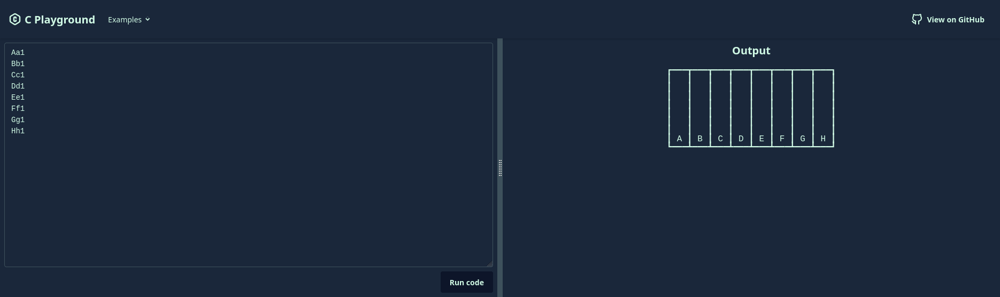

# C Playground

> Try the C esolang in your browser!

An online playground/demo for the "C" programming language, made with Voby, Tailwind CSS and daisyUI.

If you're wondering what this programming language is, you should probably read the [project's main README.md](../README.md) first.

## Try it online

Head to **<https://c-playground.netlify.app/>**

## Contributing

1. Clone the monorepo: `git clone https://github.com/MMK21Hub/C.git`
2. `cd C`
3. Install dependencies: `yarn install`
4. Start the development server: `yarn workspace c-playground dev`

## AI usage

I have used GitHub Copilot's suggestions where appropriate. I would guess around 10% of code was generated by AI.
